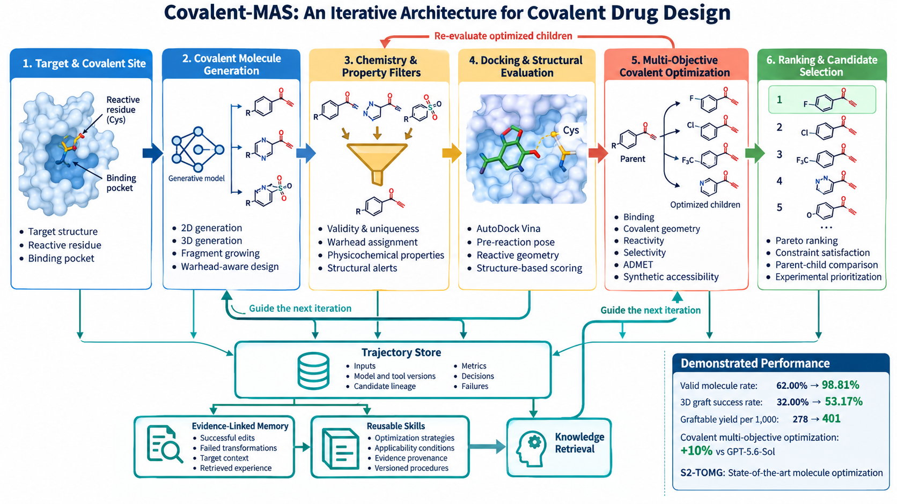

# Covalent-MAS

## Team

Covalent-MAS is developed by a joint research team from **East China Normal
University (ECNU)** and the **Shanghai Innovation Institute (SII)**. Our team
brings together expertise in artificial intelligence, computational chemistry,
molecular modeling, and drug discovery to advance covalent molecule generation,
multi-objective optimization, structure-based evaluation, and iterative
learning.

<p align="center">
  
  &nbsp;&nbsp;&nbsp;
  
</p>

* **☀️ (News):** Covalent-MAS v1.0 is now available, featuring covalent
  molecule generation, multi-objective optimization, and evidence-driven
  trajectory learning.

Covalent-MAS is a modular architecture for iterative covalent drug design. It
connects target preparation, covalent molecule generation, chemistry filters,
structure-based evaluation, multi-objective optimization, and evidence-driven
learning through stable Python interfaces.

The architecture is model- and tool-agnostic. Generative models, property
optimizers, docking engines, and external services can be integrated without
changing the workflow contracts. This release includes an AutoDock Vina
adapter and portable JSON/JSONL data structures for candidates, evaluations,
optimization results, and design trajectories.

## Results

Our covalent molecule generation pipeline improved generation quality and
3D grafting performance under the same project evaluation protocol:

| Metric | Baseline | Covalent-MAS | Improvement |
| --- | ---: | ---: | ---: |
| Valid molecule rate | 62.00% | **98.81%** | +36.81 percentage points |
| 3D graft success rate | 32.00% | **53.17%** | +21.17 percentage points |
| Graftable yield per 1,000 requests | 278 | **401** | +44.2% |

For molecule optimization:

- Our covalent-drug multi-objective optimizer achieves **10% higher aggregate
  performance than GPT-5.6-Sol** on our covalent optimization benchmark.
- **S2-TOMG, our general chemical molecule optimizer, achieves state-of-the-art
  performance** in our evaluation setting.

These values compare methods with the same task definitions, inputs, and
evaluation protocol. Candidate structures still require downstream
computational review and experimental validation.

## Architecture

<p align="center">
  
</p>

The workflow supports an iterative design loop:

1. Prepare the target structure and define the reactive site.
2. Generate covalent candidates with a 2D, 3D, fragment-growing, or custom
   generative model.
3. Apply validity, warhead, physicochemical, and project-specific filters.
4. Evaluate surviving molecules with docking and structural checks.
5. Optimize selected parents against multiple covalent-drug objectives.
6. Re-evaluate optimized children with the same filters and structural tools.
7. Record the full trajectory and derive evidence-linked memory and skills.
8. Retrieve relevant experience to guide the next design iteration.

## Core Interfaces

| Interface | Purpose |
| --- | --- |
| `CandidateGenerator` | Integrates molecule generation models or services. |
| `CovalentOptimizer` | Integrates multi-objective covalent molecule optimization models. |
| `DockingTool` | Normalizes docking backends behind a shared request/result contract. |
| `TrajectoryStore` | Appends and queries generation, evaluation, and optimization events. |
| `ExperienceBuilder` | Builds evidence-linked memory and reusable skills from trajectories. |
| `KnowledgeRetriever` | Retrieves relevant memory and skills for the next iteration. |

Each optimized molecule retains its parent identifier and model metadata.
Memory and skill records retain their source event identifiers, so learned
experience remains traceable to the trajectories that support it.

## Repository Layout

```text
src/covalent_generation/
|-- interfaces.py   # Shared model, tool, optimization, and learning contracts
|-- pipeline.py     # Candidate docking and optimization orchestration
|-- learning.py     # Append-only JSONL trajectory store
|-- vina.py         # AutoDock Vina command-line adapter
`-- cli.py          # covalent-mas command
examples/
|-- candidates.csv
`-- docking_config.json
tests/
`-- test_workflow.py
```

## Installation

Python 3.10 or later is recommended.

```bash
git clone --branch v1.0 https://github.com/JamesKInner/Covalent-MAS.git
cd Covalent-MAS
python -m venv .venv
source .venv/bin/activate       # Windows: .venv\Scripts\activate
python -m pip install -e .
```

Install [AutoDock Vina](https://github.com/ccsb-scripps/AutoDock-Vina) before
using the included docking adapter, and ensure that the `vina` executable is
available on `PATH`.

## AutoDock Vina Example

Prepare a receptor and one PDBQT ligand for each candidate:

```text
inputs/receptor.pdbqt
inputs/ligands/example_001.pdbqt
inputs/ligands/example_002.pdbqt
```

Candidate metadata is read from CSV:

```csv
candidate_id,smiles,source
example_001,CCOc1ccc(NC(=O)C=C)cc1,my_generator
example_002,COc1ccc(NC(=O)C=C)cc1,my_generator
```

Run docking with a search box defined for the target binding site:

```bash
covalent-mas \
  --candidates examples/candidates.csv \
  --receptor inputs/receptor.pdbqt \
  --ligand-dir inputs/ligands \
  --center 10.0 12.0 8.0 \
  --box-size 20.0 20.0 20.0 \
  --exhaustiveness 8 \
  --output-dir outputs/docking \
  --results outputs/docking_results.json
```

The output JSON records execution status, Vina affinity, pose path, tool name,
and failure information for each candidate.

## Multi-Objective Covalent Optimization

`CovalentOptimizer` is the integration point for models trained to optimize
multiple covalent-drug properties across different warhead families and
chemical series. Objectives can represent binding, covalent geometry,
reactivity, selectivity, physicochemical properties, ADMET, or synthetic
accessibility.

```python
from covalent_generation import (
    Candidate,
    OptimizationObjective,
    OptimizationRequest,
    OptimizationResult,
)


class ProjectCovalentOptimizer:
    name = "project-multi-objective-optimizer"

    def optimize(self, request: OptimizationRequest) -> OptimizationResult:
        children, values = run_model(
            parent_smiles=request.parent.smiles,
            target=request.target,
            objectives=request.objectives,
            memory=request.recalled_memory,
            skills=request.active_skills,
            limit=request.limit,
        )
        return OptimizationResult(
            parent_candidate_id=request.parent.candidate_id,
            candidates=tuple(
                Candidate(item.id, item.smiles, source=self.name)
                for item in children
            ),
            status="completed",
            model=self.name,
            objective_values=values,
        )


objectives = (
    OptimizationObjective("docking_score", direction="minimize", weight=1.0),
    OptimizationObjective("covalent_geometry", direction="maximize", weight=1.0),
    OptimizationObjective("selectivity", direction="maximize", weight=0.8),
    OptimizationObjective("synthetic_accessibility", direction="minimize", weight=0.5),
)
```

Optimized children should always return to the filtering and evaluation stages.
An optimizer score is a proposal signal, while advancement decisions should be
based on independently recomputed evidence.

## Trajectories, Memory, and Skills

Every generation, filtering, evaluation, optimization, and selection action
can be recorded as a `TrajectoryEvent`. The included `JsonlTrajectoryStore`
provides an append-only local implementation:

```python
from datetime import datetime, timezone
from pathlib import Path

from covalent_generation import JsonlTrajectoryStore, TrajectoryEvent


store = JsonlTrajectoryStore(Path("outputs/trajectories.jsonl"))
store.append(
    TrajectoryEvent(
        event_id="run-001-optimize-001",
        run_id="run-001",
        target_id="TARGET_ID",
        iteration=2,
        stage="multi_objective_optimization",
        created_at=datetime.now(timezone.utc).isoformat(),
        candidate_ids=("parent-001", "child-001"),
        inputs={"parent_id": "parent-001", "model": "project-optimizer"},
        outputs={"child_ids": ["child-001"]},
        metrics={"objective_score": 0.84},
        decision="send_to_re_evaluation",
    )
)
```

The learning interfaces separate three responsibilities:

- `ExperienceBuilder.build_memory` converts trajectories into concise,
  evidence-linked observations about successful and failed design choices.
- `ExperienceBuilder.build_skills` converts repeated, supported patterns into
  versioned procedures with explicit applicability conditions.
- `KnowledgeRetriever.retrieve` selects relevant memory and skills for the
  current target, warhead, parent molecule, and optimization objective.

Retrieved knowledge is passed through `GenerationRequest` or
`OptimizationRequest` using the `recalled_memory` and `active_skills` fields.
This closes the loop between previous design outcomes and the next generation
or optimization round while retaining the source evidence needed for review
and reproducibility.

## Evaluation Framework

| Stage | Recommended checks | Representative outputs |
| --- | --- | --- |
| Structure preparation | Chain and residue identity, protonation, file integrity | Prepared receptor, reactive-site coordinates |
| Molecule generation | Validity, uniqueness, warhead assignment, 3D grafting | Validity rate, graft success rate, graftable yield |
| Chemistry filtering | MW, cLogP, TPSA, HBD/HBA, alerts, project constraints | Pass/fail decision and rejection reasons |
| Docking | Successful execution, pose generation, search-box coverage | Score, pose, execution status |
| Multi-objective optimization | Pareto improvement, constraint satisfaction, diversity | Parent-child comparison and objective values |
| Learning loop | Evidence coverage, retrieval relevance, next-round uplift | Memory, skills, provenance, iteration metrics |

Standard AutoDock Vina docking is intended for pre-reaction pose and pocket
occupancy screening. It does not by itself establish covalent bond formation.
A production workflow can extend `DockingTool` with reactive-atom distance and
angle checks, covalent docking, pose validation, selectivity assessment, and
other target-specific evidence.

## Reproducibility

- Record structure preparation, protonation, force field, atom typing, tool
  versions, model versions, random seeds, and all search parameters.
- Compare docking scores only under the same receptor, binding site, engine,
  and parameterization.
- Preserve candidate lineage and independently re-evaluate optimized children.
- Keep memory and skills linked to the trajectory events used to construct
  them, and version every promoted skill.
- Treat computational candidates as design hypotheses requiring expert review
  and experimental validation.

## License

This project is released under the [MIT License](LICENSE). Third-party tools,
including AutoDock Vina, remain subject to their respective licenses.
